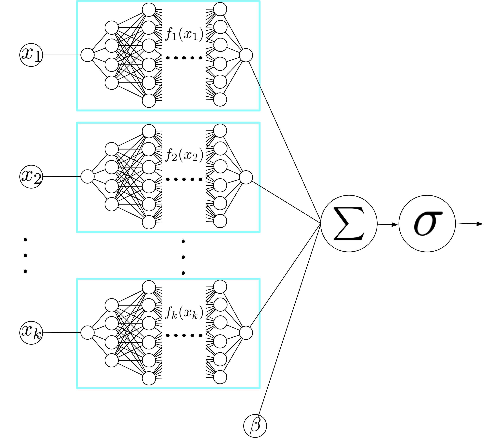

  

Deep neural networks (DNNs) are powerful black-box predictors that have achieved impressive performance on a wide variety of tasks. However, their accuracy comes at the cost of intelligibility: it is usually unclear how they make their decisions. This hinders their applicability to high stakes decision-making domains such as healthcare. We propose Neural Additive Models (NAMs) which combine some of the expressivity of DNNs with the inherent intelligibility of generalized additive models. NAMs learn a linear combination of neural networks that each attend to a single input feature. These networks are trained jointly and can learn arbitrarily complex relationships between their input feature and the output. Our experiments on regression and classification datasets show that NAMs are more accurate than widely used intelligible models such as logistic regression and shallow decision trees. They perform similarly to existing state-of-the-art generalized additive models in accuracy, but can be more easily applied to real-world problems.

Citing
------
If you find this open source release useful, please reference in your paper:

  @article{agarwal2020neural,
    title={Neural additive models: Interpretable machine learning with neural nets},
    author={Agarwal, Rishabh and Frosst, Nicholas and Zhang, Xuezhou and Caruana, Rich and Hinton, Geoffrey E},
    journal={arXiv preprint arXiv:2004.13912},
    year={2020}
}

## Authors



  
  <a href="{{ person.url | relative_url }}">{{ person.name }}</a> 
  {{ person.title | replace: '&', ' ' }}
  <!--span>({{ person.topics }})</span-->



For questions, please contact us at:
<a href="mailto:rishabhagarwal@google.com">rishabhagarwal@google.com</a>,
<a href="mailto:rcaruana@microsoft.com">rcaruana@microsoft.com</a>.

